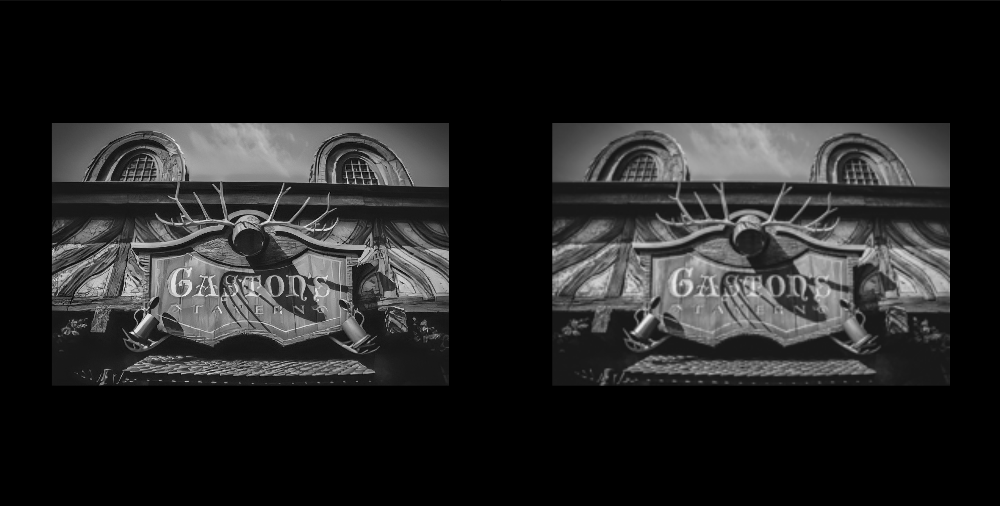
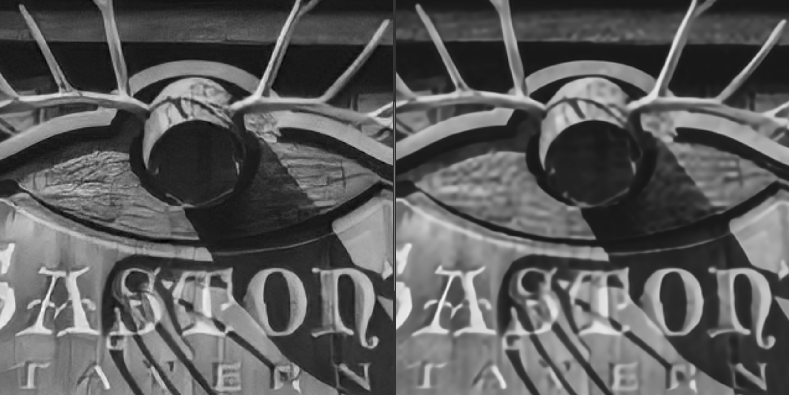

# VideoSR

VideoSR, which trained for YCbCr sequence, to handle YCbCr video without any conversion.  
However, currently version **only support Y component**.  
The channel of Y, Cb and Cr is all 1, therefore you can test it by using Cb and Cr, but it's result is optimised to Y component.  

**About VideoSR**  
VideoSR is a part of the "[Sharpic](https://github.com/GCU-Graduate-Project-Sharpic/Sharpic)", which automatically generate HQ sequences from LQ sequences. (Less than 2K).  

## Pre-requirements for usage  

- [YUVESRGAN (BasicSR)](https://github.com/Hyunmin-jasper-Cho/YUVSRGAN/tree/main/BasicSR#pre-requirements-for-usage)  

## Training environment 
> NVIDIA GPU & CUDA  
> pytorch 1.12    

> `Time consumption (NVIDIA Tesla P100): (24+ Hours)`  

## How to test  

- [YUVESRGAN (BasicSR)](https://github.com/Hyunmin-jasper-Cho/YUVSRGAN/tree/main/BasicSR#how-to-test)  

## Sample images  
- YUVESRGAN (BasicSR)
  
- RealSR-YUV (RealSR)  
  
- RealSR-YUV : YUVESRGAN   
  

## Average PSNR of RealSR(Anchor) : RealSR-YUV  
Test dataset: Flickr2K 2451-2650  
| Metrics | Anchor(Original RealSR) | Real-YUV | 
| :---: | :---: | :---: | 
| PSNR-Y | 25.595302 | **25.845682** |
| MSSIM |  |  | 
